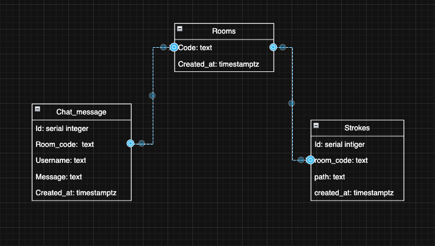

# SkribblClone-RN

Real-time collaborative drawing app inspired by Skribbl.io, built with React Native and Socket.IO.

   

## Features

- Real-time collaborative drawing synced across all connected devices
- Live stroke preview (see others drawing as they draw)
- Persistent canvas — strokes survive server restarts
- In-room chat with message history
- Multi-room support
- Works on iOS, Android, and Web

## Tech Stack

| Layer | Technology |
|---|---|
| Frontend | Expo / React Native / react-native-svg |
| Backend | Node.js / Express / Socket.IO |
| Database | PostgreSQL |
| ORM/Driver | node-postgres (pg) |

## Project Structure

```
SkribblClone-RN/
├── app/               # Expo / React Native frontend
│   ├── index.tsx      # Start page (name entry)
│   └── game.tsx       # Drawing canvas + chat
└── server/            # Node.js backend
    ├── server.js
    ├── .env           # Your local config (not committed)
    └── .env.example
```

---

## Prerequisites

Make sure you have these installed before starting:

- [Node.js](https://nodejs.org/) v18 or later
- [PostgreSQL](https://www.postgresql.org/) v14 or later
- [Expo CLI](https://docs.expo.dev/get-started/installation/) — `npm install -g expo-cli`
- Expo Go app on your phone (optional, for mobile testing)

---

## 1. PostgreSQL Setup

### Install PostgreSQL

**Arch Linux:**
```bash
sudo pacman -S postgresql
sudo -u postgres initdb -D /var/lib/postgres/data
sudo systemctl enable --now postgresql
```

**Ubuntu / Debian:**
```bash
sudo apt install postgresql
sudo systemctl enable --now postgresql
```

**macOS:**
```bash
brew install postgresql@16
brew services start postgresql@16
```

**Windows:** Download the installer from [postgresql.org](https://www.postgresql.org/download/windows/) and follow the setup wizard.

---

### Create the database and user

Open the PostgreSQL shell:

```bash
sudo -u postgres psql        # Linux
psql postgres                # macOS / Windows
```

Then run:

```sql
CREATE USER skribbl_user WITH PASSWORD 'yourpassword';
CREATE DATABASE skribbl OWNER skribbl_user;
GRANT ALL PRIVILEGES ON DATABASE skribbl TO skribbl_user;
\q
```

---

### Create the tables

Connect to the database and create the schema:

```bash
# Linux
sudo -u postgres psql -d skribbl

# macOS / Windows (if you set a password, add -h localhost)
psql -U skribbl_user -d skribbl -h localhost
```

Then paste:

```sql
CREATE TABLE rooms (
  code        TEXT PRIMARY KEY,
  created_at  TIMESTAMPTZ DEFAULT NOW()
);

CREATE TABLE strokes (
  id          SERIAL PRIMARY KEY,
  room_code   TEXT REFERENCES rooms(code) ON DELETE CASCADE,
  path        TEXT NOT NULL,
  created_at  TIMESTAMPTZ DEFAULT NOW()
);

CREATE TABLE chat_messages (
  id          SERIAL PRIMARY KEY,
  room_code   TEXT REFERENCES rooms(code) ON DELETE CASCADE,
  username    TEXT NOT NULL,
  message     TEXT NOT NULL,
  created_at  TIMESTAMPTZ DEFAULT NOW()
);

-- Grant table-level permissions
GRANT ALL PRIVILEGES ON ALL TABLES IN SCHEMA public TO skribbl_user;
GRANT ALL PRIVILEGES ON ALL SEQUENCES IN SCHEMA public TO skribbl_user;
ALTER DEFAULT PRIVILEGES IN SCHEMA public GRANT ALL ON TABLES TO skribbl_user;
ALTER DEFAULT PRIVILEGES IN SCHEMA public GRANT ALL ON SEQUENCES TO skribbl_user;
```



---

## 2. Server Setup

```bash
cd server
npm install
```

Create your `.env` file (copy from the example):

```bash
cp .env.example .env
```

Edit `.env` with your values:

```env
DB_HOST=localhost
DB_USER=skribbl_user
DB_PASSWORD=yourpassword
DB_NAME=skribbl
```

> **Important:** Always use `localhost` as `DB_HOST` if your server and PostgreSQL are on the same machine. Using your network IP (e.g. `192.168.x.x`) will cause `ECONNREFUSED` errors because PostgreSQL only listens on localhost by default.

Find your local IP address (needed for the frontend config):

```bash
# Linux / macOS
ip addr show   # or: ifconfig

# Windows
ipconfig
```

Open `server/server.js` and confirm the port is `3000` (or change it if needed).

Start the server:

```bash
node server.js
# → Server on port 3000
```

---

## 3. Frontend Setup

```bash
cd app
npm install
```

Open `app/game.tsx` and update the socket URL to your machine's **local IP address**:

```ts
// Replace with your actual local IP
const socket = io("http://192.168.x.x:3000");
```

> Both devices (phone and PC) must be on the **same Wi-Fi network** for local IP connections to work.

Start the Expo dev server:

```bash
npx expo start
```

Then:
- Press `w` to open in browser
- Scan the QR code with the **Expo Go** app on your phone
- Press `a` for Android emulator / `i` for iOS simulator

---

## Troubleshooting

**`ECONNREFUSED` on port 5432**
PostgreSQL isn't running. Start it:
```bash
sudo systemctl start postgresql   # Linux
brew services start postgresql@16 # macOS
```

**`permission denied for table rooms`**
Run the `GRANT` statements from the schema section above in psql.

**`CORS request did not succeed` / can't connect from phone**
- Make sure your phone and computer are on the same Wi-Fi network
- Check that port 3000 is not blocked by a firewall
- On Windows, allow it: `New-NetFirewallRule -DisplayName "Node 3000" -Direction Inbound -Protocol TCP -LocalPort 3000 -Action Allow`
- Double-check the IP in `game.tsx` matches your machine's current local IP (`ip addr` / `ipconfig`)

**Canvas not syncing between devices**
- Confirm both clients show the same room code
- Check the server terminal for `join-room received: 123` from both connections
- Make sure you're not running an old version of the server that still has `roomsData` in-memory checks

---

## Environment Variables Reference

| Variable | Description | Example |
|---|---|---|
| `DB_HOST` | PostgreSQL host — use `localhost` | `localhost` |
| `DB_USER` | PostgreSQL username | `skribbl_user` |
| `DB_PASSWORD` | PostgreSQL password | `yourpassword` |
| `DB_NAME` | Database name | `skribbl` |

---

## Contributing

Pull requests are welcome. For major changes, open an issue first to discuss what you'd like to change.

---

*Inspired by [Skribbl.io](https://skribbl.io). Built for learning purposes.*